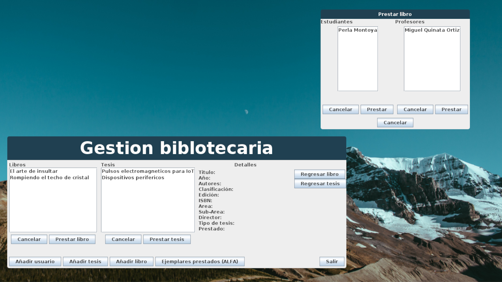
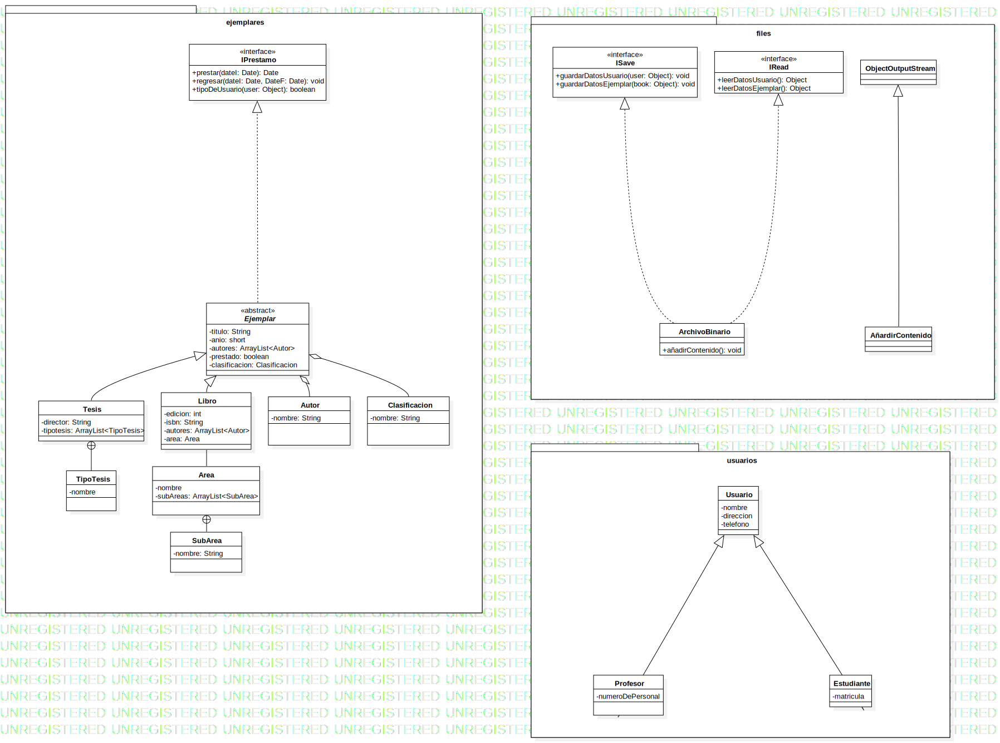
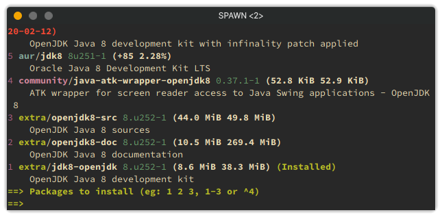

## Descripción
Proyecto final Programación

## DIAGRAMA UML


**Requisitos previos**
- JDK 1.8 - OPEN JDK 1.8 o superior

**Usar a través de git**

```git clone https://github.com/spawmc/GestionBiblotecaria-Java.git´´´

 podemos compilar por medio del scrip ´compilador.sh´ o usar directamente desde los archivos ya compilados haciendo uso de ´java GestionBibliotecaria´

**¿Como compilar con el script?**

- Le daremos permisos de lectura, escritura y ejecución usando 'chmod +x compilador.sh' o 'chmod +777 compilador.sh' y después solo debe ejecutarse './compilador.sh'

**¿Como ejecutar?**

- Tenemos dos opciones: 
    1. Ejecutar el script, dando permisos de lectura, escritura y ejecución: ´chmod +x ejecutador.sh´ y ´./ejecutador.sh' o bien,
    2. Podemos usar ´java GestionBibliotecaria´ y listo :).

## Mi versión de JDK



